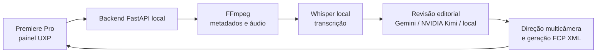

# Assistente de Decupagem

Ferramenta local para acelerar a pré-edição de videoaulas e videocasts no Adobe Premiere Pro. Ela sincroniza fontes, transcreve o áudio, identifica trechos úteis, sugere cortes e gera um FCP XML pronto para importar e revisar no Premiere.

O projeto combina um painel UXP no Premiere com um backend Python executado na própria máquina. Os vídeos e áudios permanecem locais; apenas o texto necessário para a análise editorial pode ser enviado aos provedores de IA configurados.



## O que ele faz

- Sincroniza as câmeras e áudios externos com base no áudio de referência.
- Transcreve localmente com `faster-whisper`.
- Analisa a transcrição para remover pausas, repetições e trechos pouco úteis.
- Usa Gemini como revisor editorial principal e NVIDIA Kimi K3 como alternativa textual; há fallback local quando os serviços remotos não respondem.
- Em videocasts, direciona as câmeras pela voz ativa e mantém cada plano por pelo menos 5 segundos para evitar trocas artificiais. Opcionalmente, o áudio pode acompanhar a câmera selecionada.
- Gera FCP XML multicâmera, com fontes e faixas de áudio organizadas para importação no Premiere.
- Sugere letterings e registra feedbacks de revisão para aperfeiçoar resultados futuros.

## Requisitos

- Windows 10 ou 11
- Python 3.11 ou superior
- FFmpeg e `ffprobe` disponíveis no `PATH`
- Adobe Premiere Pro 25.6 ou superior
- UXP Developer Tool, para carregar o painel em desenvolvimento

As integrações de IA remota são opcionais. Sem elas, o processamento pode usar os recursos locais, com uma revisão editorial mais limitada.

## Instalação rápida

No PowerShell, dentro da pasta do projeto:

```powershell
Set-ExecutionPolicy -Scope Process -ExecutionPolicy Bypass
.\setup_teste_windows.ps1
```

O script cria o ambiente virtual, instala as dependências e executa os testes. Se preferir fazer manualmente:

```powershell
py -3.11 -m venv .venv
.\.venv\Scripts\Activate.ps1
python -m pip install --upgrade pip
pip install -r .\backend\requirements.txt
pytest .\backend
```

## Configuração segura das APIs

Crie seu arquivo local de configuração a partir do modelo:

```powershell
Copy-Item .env.example .env
```

Edite somente o `.env`. Ele já está no `.gitignore` e **nunca deve ser enviado ao GitHub**.

| Variável | Uso |
| --- | --- |
| `GEMINI_API_KEY` | Chave do Google AI Studio para a revisão editorial principal. |
| `GEMINI_MODEL` | Modelo Gemini prioritário. |
| `GEMINI_FALLBACK_MODELS` | Modelos Gemini alternativos, separados por vírgula. |
| `NVIDIA_API_KEY` | Chave da NVIDIA para o fallback Kimi K3. Informe apenas o valor da chave, sem `Bearer `. |
| `NVIDIA_MODEL` | Modelo NVIDIA; o padrão é `moonshotai/kimi-k3`. |
| `NVIDIA_BASE_URL` | Endpoint base da NVIDIA. |
| `NVIDIA_REASONING_EFFORT` | Nível de raciocínio solicitado ao modelo NVIDIA. |
| `FFMPEG_TIMEOUT_SECONDS` | Tempo máximo de operações longas do FFmpeg. |

Exemplo seguro de preenchimento:

```dotenv
GEMINI_API_KEY="cole_a_chave_aqui"
NVIDIA_API_KEY="cole_a_chave_aqui"
```

Não use chaves reais em documentação, commits, prints, issues ou mensagens. Caso uma chave seja exposta, revogue-a no provedor e gere outra antes de continuar.

## Executando o backend

```powershell
.\.venv\Scripts\python.exe .\backend\main.py
```

Com o servidor ativo, valide a disponibilidade local:

```powershell
Invoke-RestMethod http://127.0.0.1:8000/health
```

Diagnósticos específicos, sem revelar as chaves, estão disponíveis em:

```text
http://127.0.0.1:8000/diagnostics/gemini
http://127.0.0.1:8000/diagnostics/nvidia
```

## Usando no Premiere

1. Abra o UXP Developer Tool e carregue `premiere_plugin`.
2. Abra o painel **Assistente de Decupagem** no Premiere.
3. Confirme que o backend está em execução na porta `8000`.
4. Selecione o modo de trabalho e as fontes de vídeo/áudio.
5. Inicie o processamento e aguarde o XML ser gerado.
6. Importe o FCP XML no Premiere e faça a revisão final de cortes, sincronia e áudio.

Se uma tentativa remota falhar, o painel mantém as escolhas de arquivos e opções; use o botão **Tentar novamente** após ajustar a conexão ou a configuração da API.

## Estratégia de revisão editorial

| Ordem | Serviço | Papel |
| --- | --- | --- |
| 1 | Gemini | Revisão editorial principal. |
| 2 | NVIDIA NIM / Kimi K3 | Alternativa textual com a transcrição completa e o mesmo contrato editorial do Gemini. Não recebe o WAV. |
| 3 | Mecanismo local | Continuidade do processamento quando os provedores remotos falham. |

Uma resposta `503` de um provedor significa indisponibilidade temporária do serviço, não necessariamente chave inválida. Dependendo do estágio em que a solicitação falha, ela pode consumir tokens de entrada mesmo sem retornar um resultado editorial válido. Os diagnósticos acima ajudam a separar falha de autenticação, modelo indisponível e sobrecarga.

## Endpoints locais principais

| Método | Rota | Finalidade |
| --- | --- | --- |
| `GET` | `/health` | Estado do backend. |
| `GET` | `/diagnostics/gemini` | Diagnóstico seguro da configuração Gemini. |
| `GET` | `/diagnostics/nvidia` | Diagnóstico seguro da configuração NVIDIA. |
| `POST` | `/process` | Processamento principal e geração do XML. |
| `POST` | `/analyze-lettering` | Sugestões de lettering. |
| `GET/POST` | `/learning/*` | Consulta e registro de feedback editorial. |

## Estrutura do repositório

```text
backend/                 API FastAPI, análise editorial, transcrição e XML
premiere_plugin/         painel UXP para Adobe Premiere Pro
video/                   materiais de interface do painel
setup_teste_windows.ps1  instalação e testes em Windows
.env.example             modelo seguro de configuração
GUIA_TESTE_OUTRA_MAQUINA.md
PROJECT_CONTEXT.md       contexto técnico e histórico do projeto
```

## Segurança antes de publicar no GitHub

O `.gitignore` protege chaves, certificados, logs, diagnósticos, XMLs gerados, cache de testes e dados locais de aprendizado. Antes de cada envio, confira o que será versionado:

```powershell
git status
git diff --cached --check
git ls-files .env
```

O último comando não deve retornar nada. Também confirme que vídeos, áudios brutos e resultados de edição permanecem fora do repositório. O arquivo `.env.example` deve conter apenas nomes de variáveis e valores de exemplo.

## Testes

```powershell
.\.venv\Scripts\python.exe -m pytest .\backend
```

Para um teste rápido da integração NVIDIA sem exibir a chave:

```powershell
.\.venv\Scripts\python.exe .\backend\diagnose_nvidia.py
```

## Documentação complementar

- [Guia de teste em outra máquina](GUIA_TESTE_OUTRA_MAQUINA.md)
- [Contexto técnico do projeto](PROJECT_CONTEXT.md)
- [Backlog e sprints](SPRINTS_BACKLOG.md)

---

O XML gerado é um ponto de partida para a edição: revise sempre sincronia, cortes, troca de câmeras e mixagem antes da entrega final.
